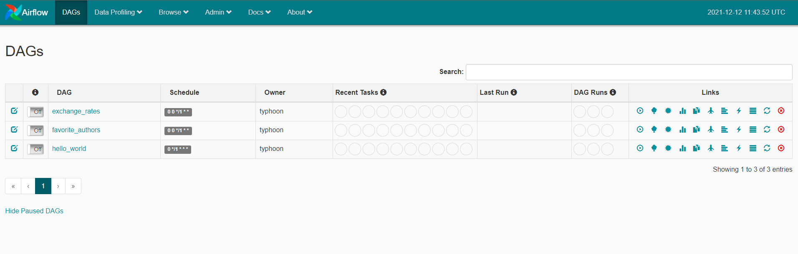
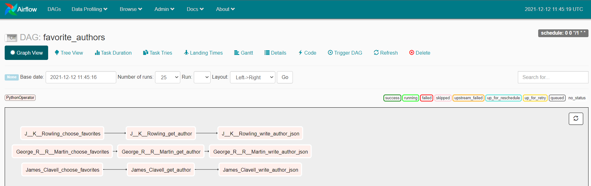
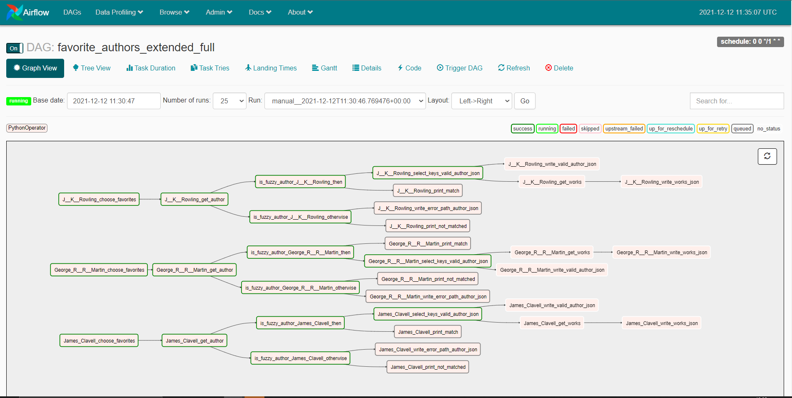

<p align="center">
<br>
<a href="https://typhoon.talkyard.net/">Forum :wave:</a> |
 <a href="https://typhoon-data-org.github.io/typhoon-orchestrator/getting-started/installation.html#with-pip">Installation :floppy_disk:</a> |
 <a href="https://typhoon-data-org.github.io/typhoon-orchestrator/index.html">Documentation :notebook: </a>
<br>️
<br>
<br>️

</p>
<br>
<p align="center"><b>Elegant YAML DAGS for Data Pipelines</br>Deploy to your existing Airflow.</b></p>
<br>️
<p align="center">


</p>

<p align="center">
<br> 
<a href="https://github.com/typhoon-data-org/typhoon-orchestrator/">Why Typhoon?</a> |  
 <a href="https://github.com/typhoon-data-org/typhoon-orchestrator/">Key Features</a> |
 <a href="https://github.com/typhoon-data-org/typhoon-orchestrator/">Example YAML</a> |
 <a href="https://github.com/typhoon-data-org/typhoon-orchestrator/">Installation</a>
<br>️


<hr>

# Why Typhoon (+ Airflow)?

Airflow is great!

***Typhoon lets you write Airflow DAGS faster*** :rocket::
  
    **Workflow**: Typhoon YAML DAG --> Typhoon build --> Airflow DAG 

Simplicity and re-usability; a toolkit designed to be loved by Data Engineers :heart:

# Key features
<table style="border: none" cellspacing="0" cellpadding="0">
<tr>
<td width="50%">

**Elegant** -  YAML; low-code and easy to learn.

**Code-completion** - Fast to compose. (VS Code recommended).

**Data sharing** -  data flows between tasks making it super intuitive.

**Composability** -  Functions and connections combine like Lego.


</td>
<td>
</td>
</tr>
<tr>
<td width="50%">

**Components** - reduce complex tasks to 1 re-usable tasks

Packaged examples:
- Glob & Compress  
- FileSystem to DB
- DB to FileSystem
- DB to Snowlfake

**UI**: Share pre-built components (data pipelines) with your team :raised_hands:

</td>
<td>
</td>
</tr>
<tr>
<td width="50%">

**Rich CLI & Shell**: Inspired by others; instantly familiar.

**Testable Tasks** - automate DAG task tests.

**Testable Python** - test functions or full DAGs with PyTest.

</td>
<td>
</td>
</tr>

</table>


# Example YAML DAG
    
      name: favorite_authors
      schedule_interval: rate(1 day)
      
      tasks:
        choose_favorites:
          function: typhoon.flow_control.branch
          args:
            branches:
              - J. K. Rowling
              - George R. R. Martin
              - James Clavell
      
        get_author:
          input: choose_favorites
          function: functions.open_library_api.get_author
          args:
            author: !Py $BATCH
      
        write_author_json:
          input: get_author
          function: typhoon.filesystem.write_data    
          args:
            hook: !Hook data_lake
            data:  !MultiStep
              - !Py $BATCH['docs']
              - !Py typhoon.data.json_array_to_json_records($1)
            path: !MultiStep 
              - !Py $BATCH['docs'][0]['key']
              - !Py f'/authors/{$1}.json'
            create_intermediate_dirs: True


*Getting the works of my favorite authors from Open Library API*


# Installation

See [documentation](https://typhoon-data-org.github.io/typhoon-orchestrator/getting-started/installation.html) for detailed guidance on installation and walkthroughs. 

## with pip (typhoon standalone)

Install typhoon: 
```bash
pip install typhoon-orchestrator[dev]
```
Optionally, install and activate virtualenv.

Then: 
```bash 
typhoon init hello_world
cd hello_world
typhoon status
```

This will create a directory named hello_world that serves as an example project. As in git, when we cd into the directory it will detect that it's a Typhoon project and consider that directory the base directory for Typhoon (TYPHOON_HOME).

#### Adding connnections

You can add a default connections as follows in the cli

```bash
typhoon connection add --conn-id data_lake --conn-env local
# Check that it was added
typhoon connection ls -l
```

## With Docker and Airflow

To deploy Typhoon with Airflow you need: 

- Docker / Docker Desktop (You must use WSL2 on Windows) 
- Download the [docker-compose.yaml][1]  (or use curl below)
- Create a directory for your TYPHOON_PROJECTS_HOME

The following sets up your project directory and gets the docker-compose.yml:
```bash
TYPHOON_PROJECTS_HOME="/tmp/typhoon_projects" # Or any other path you prefer
mkdir -p $TYPHOON_PROJECTS_HOME/typhoon_airflow_test
cd $TYPHOON_PROJECTS_HOME/typhoon_airflow_test
mkdir src
curl -LfO https://raw.githubusercontent.com/typhoon-data-org/typhoon-orchestrator/master/docker-compose-af.yml

docker compose -f docker-compose-af.yml up -d  
docker-compose -f docker-compose-af.yml run --rm typhoon-af airflow initdb
docker-compose -f docker-compose-af.yml run --rm typhoon-af typhoon status
docker-compose -f docker-compose-af.yml run --rm typhoon-af typhoon connection add --conn-id data_lake --conn-env local  # Adding our first connection!
docker-compose -f docker-compose-af.yml run --rm typhoon-af typhoon dag build --all
docker restart typhoon-af # Wait while docker restarts
```

This runs a container with only 1 service, `typhoon-af`. This has both Airflow and Typhoon installed on it ready to work with.

You should be able to then check `typhoon status` and also the airlfow UI at [http://localhost:8088](http://localhost:8088)


*Typhoon DAGS listed in airflow UI*

**Development hints are [in the docs](https://typhoon-data-org.github.io/typhoon-orchestrator/getting-started/installation.html#directories).**


*Favorite Authors DAG - as displayed in airflow UI*

We can extend the above task to give an example with more complexity. The tutorial for this has some more advanced tips. The airflow compiled DAG handles complex DAG structures very nicely:


*Favorite Authors Extended - a complex DAG example*

