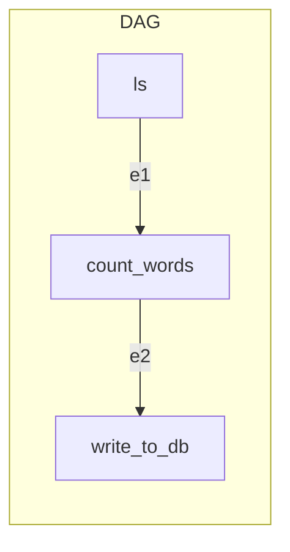

# DAG Development Tutorial

Let's start from scratch with a very basic DAG. Every hour we will read all the files under the directory `/tmp/typhoon/landing/`, count the number of words and write that number in a SQLite database. The SQLite table we write to will have the following shape:

| file_name | num_words | ts |
|---|---|---|
| a.txt | 13 | 2020-01-06T13:01:15
| b.txt | 20 | 2020-01-06T13:01:17
| c.txt | 10 | 2020-01-06T13:01:19

!!! note "Learning example"
    This is just an example for learning purposes. In a production deployment this would not be a useful DAG since in a Lambda instance there won't be any data under `tmp`. We also won't be able to retrieve the SQLite database because it's persisted to a local file, which will disappear once the lambda finishes running.
    
    However, it is still a good example to learn the basics in a local environment as it's a simple example and not that far off from real applications. Just replace the function that reads locally with a function that reads from an FTP location and the function that writes to SQLite with a function that writes to any other remote database.

## Functions and transformations

When trying to solve a problem in python it is useful to write some functions and test them until we get our solution right, whether it is in a jupyter notebook or REPL. Typhoon encourages this kind of interactive development as we can trivially incorporate these functions into our DAGs.

### Reading from a directory

Our first function will search inside a directory and yield the `.txt` file paths in batches:

```python
from typing import Iterator
from pathlib import Path

def get_files_in_directory(directory: str) -> Iterator[str]:
    yield from map(str, Path(directory).glob('*.txt'))
```

Let's place this code inside a file called `functions/tutorial.py`.

!!! info "Pathlib"
    If this is the first time you see the pathlib library [check it out](https://docs.python.org/3/library/pathlib.html), it is one of the nicest additions to Python 3.

### Counting number of lines

Given a file path we will read it and count the number of words in it. A naive implementation might be the following:

```python
import re
from typing import Tuple
from pathlib import Path

def words_in_file(file_path: str) -> Tuple[str, int]:
    contents = Path(file_path).read_text()
    num_words = len(re.split('\s+', contents))
    return file_path, num_words
```

We just split the contents when there's one or more separators and count the length of the resulting list. Notice that we also returned the file_path as well as the number of words, since it's likely that we will need it upstream. This is a common and useful pattern in Typhoon functions.

Let's also place this code inside the previous file called `functions/tutorial.py`.

### Writing to SQLite

Once we have this information we want to write it to a SQLite table in `tmp/typhoon/tutorial.db` that we will call `typhoon_tutorial`. However if we write a function that does exactly that there's very little chance we will ever use it again. With very little effort we can make a function that can execute any query against a SQLite database. This is much more likely to be useful in the future.

```python
import sqlite3
from contextlib import closing
from typing import Sequence

def execute_on_sqlite(sqlite_db: str, query: str, parameters: Sequence):
    conn = sqlite3.connect(sqlite_db)
    with closing(conn.cursor()) as cursor:
        cursor.execute(query, parameters)
    conn.commit()
```

Finally we will also place this code inside the previous file called `functions/tutorial.py`.

!!! warning "Split functions in different files"
    Usually we would split functions in files that are descriptive of what they do so they are organised in modules. Eg: `filesystem.get_files_in_directory`. Since this is just a tutorial we keep them in the same file for simplicity.

### Testing

As you may have noticed, the fact that we wrote our code as regular python functions that just take some parameters and return some values means that it is trivially testable. Our testing framework of choice for this example is Pytest, but any other framework would work equally well.

!!! Note ""Pure" functions"
    We can't say that our functions are pure in the strict meaning of the term since they have side effects, but they share some advantages such as having no global state and being repeatable as much as possible (ie: given the same input returning the same output).
    
```python
import sqlite3
from contextlib import closing
from functions.tutorial import get_files_in_directory, words_in_file, execute_on_sqlite

def test_get_files_in_directory(tmp_path):
    file1 = tmp_path / 'a.txt'
    file1.write_text('foo')
    file2 = tmp_path / 'b.txt'
    file2.write_text('bar')
    assert set(get_files_in_directory(str(tmp_path))) == {str(file1), str(file2)}

def test_words_in_file(tmp_path):
    test_file = (tmp_path / 'a.txt')
    test_file.write_text('To be, or not to be, that is the question')
    assert words_in_file(str(test_file)) == (str(test_file), 10)

def test_execute_on_sqlite(tmp_path):
    sqlite_db = str(tmp_path/'test.db')
    conn = sqlite3.connect(sqlite_db)
    with closing(conn.cursor()) as cursor:
        cursor.execute('''CREATE TABLE stocks
             (date text, trans text, symbol text, qty real, price real)''')
    insert_query = '''INSERT INTO stocks VALUES (?,?,?,?,?)'''
    insert_query_params = ('2006-01-05', 'BUY', 'RHAR', 11, 35.14)
    execute_on_sqlite(sqlite_db, insert_query, insert_query_params)
    with closing(conn.cursor()) as cursor:
        cursor.execute('SELECT * FROM stocks')
        assert cursor.fetchone() == insert_query_params
    conn.close()
```

We can create directory `tests/` and put it in a file named `tutorial_tests.py`. Run them with `pytest` and check that they pass. Now we can be confident that our functions work as intended.

!!! info "Running tests"
    To run the tests go to the base directory of the Typhoon project and run `PYTHONPATH="PYTHONPATH:$PWD" python -m pytest tests`. This will fix the python path so the imports work correctly in the tests.

## DAG

Now that we have all the necessary functions we just need to write the DAG.

### Overview

To get an intuitive understanding of what DAG definitions do we will first show you how we would write the code in a regular python script that we want to run from the console. After that we will write the real Typhoon DAG code so the reader can compare.

!!! warning "Not real code"
    This is just an intuitive understanding of what the DAG compiles to. It's a useful model to have even though it's not entirely accurate as we will see later.
    
    Take a moment to understand this code, it will help you as a reference once we introduce the DAG code.

```python
from datetime import datetime

DIRECTORY = '/tmp/typhoon/landing/'
SQLITE_DB = '/tmp/typhoon/tutorial.db'
INSERT_QUERY = 'INSERT INTO TABLE typhoon_tutorial VALUES (?, ?, ?)'

result = get_files_in_directory(directory=DIRECTORY)
for batch in result:
    result = words_in_file(file_path=batch)
    parameters = [batch[0], batch[1], datetime.now().isoformat()]
    execute_on_sqlite(sqlite_db=SQLITE_DB, query=INSERT_QUERY, parameters=parameters)
```

### Graph representation

We can visualize these tasks in a Direct Acyclig Graph (DAG). This is how we could define the DAG:



Typhoon uses graph terminology in DAGs, defining tasks in terms of **nodes** and **edges**.

However, at run-time ls will yield a batch for each file it finds. Assuming if finds `a.txt`, `b.txt` and `c.txt` then it will yield three batches and there will be a count_words task for each. The count words node just returns one value/batch so it won't branch any further. We can visualize the run-time shape of this DAG as the following:

````mermaid
graph TB
    subgraph DAG
    ls-- a.txt -->count_words
    ls-- b.txt -->count_words2
    ls-- c.txt -->count_words3
    subgraph Branch one
    count_words -- a.txt, 12 --> write_to_db
    end
    subgraph Branch two
    count_words2 -- b.txt, 9 --> write_to_db2
    end
    subgraph Branch three
    count_words3 -- c.txt, 17 --> write_to_db3
    end
    end
````

### DAG Code

Now that we have an idea of what we want to do let's write the real DAG code that does the same.

```yaml
name: tutorial
schedule_interval: "@hourly"

nodes:
  ls:
    function: functions.tutorial.get_files_in_directory
    config:
      directory: /tmp/typhoon/landing/ 
  
  count_words:
    function: functions.tutorial.words_in_file

  write_to_db:
    function: functions.tutorial.execute_on_sqlite
    config:
      sqlite_db: /tmp/typhoon/tutorial.db
      insert_query: INSERT INTO TABLE typhoon_tutorial VALUES (?, ?, ?)
      
edges:
  e1:
    source: ls
    adapter:
      file_path => APPLY: $BATCH
    destination: count_words
    
  e2:
    source: count_words
    adapter:
      parameters => APPLY: "[$BATCH[0], $BATCH[1], $DAG_CONTEXT.execution_date.isoformat()]"
    destination: write_to_db
```

Save this code in `dags/tutorial.yml`.

!!! info "Config Vs Adapter"
    Notice how in config we are passing the static parameters, while in the adapter we are constructing the dynamic parameters from the source node's batch.

    Think of config as parameters that are static configuration, while adapter adapts the output of the source node to the dynamic input parameter of the destination node.

### Testing the edges

It can seem like the downside to having a YAML file is that code in the adapters can't be unit tested like functions can. To fix that Typhoon lets you test edges on the CLI by providing an input batch. Our DAG does not have much transformation logic, but it does have some in edge `e2`which we can test with:

```bash
typhoon dag edge test --dag-name tutorial --edge-name e2 --input "['a.txt', 3]" --eval
```

!!! warning "Eval"
    Without the `--eval` flag our input batch would be a string. We need it to evaluate that string as python code.
    
!!! tip "Testing different execution dates"
    Since the result uses the execution date we can pass it as a parameter to test with
    `--execution-date '2019-01-02'`. It accepts dates with any of the following formats `%Y-%m-%d`, `%Y-%m-%dT%H:%M:%S` or `%Y-%m-%d %H:%M:%S`. Since we didn't use any in the previous example it used the current time.

### Running the DAG

#### Creating the SQLite table

In order for the DAG to work our database needs to have the `typhoon_tutorial` table defined.

```text
> sqlite3 /tmp/typhoon/tutorial.db
SQLite version 3.30.1 2019-10-10 20:19:45
Enter ".help" for usage hints.
sqlite> CREATE TABLE typhoon_tutorial (file_name TEXT, num_words INT, ts TEXT);
```

#### DAG run
We can now run the DAG to check that it works as expected. 

```bash
typhoon dag run --dag-name tutorial
```

Result:
```text
Running tutorial from local build...
Cleaning out directory...
Build all DAGs...
Writing file to /Users/biellls/Desktop/typhoon/hello_world/out/template.yml
Writing file to /Users/biellls/Desktop/typhoon/hello_world/out/tutorial/requirements.txt
Typhoon package is in editable mode. Copying to lambda package...
Setting up user defined code as symlink for debugging...
Finished building DAGs
```

#### Checking results

Lets read the table to make sure we inserted the data correctly:

```text
> sqlite3 /tmp/typhoon/tutorial.db
SQLite version 3.30.1 2019-10-10 20:19:45
Enter ".help" for usage hints.
sqlite> .headers on
sqlite> .mode column
sqlite> select * from typhoon_tutorial;
file_name                   num_words   ts
--------------------------  ----------  --------------------------
/tmp/typhoon/landing/a.txt  5           2020-01-17T18:36:39.489866
```
