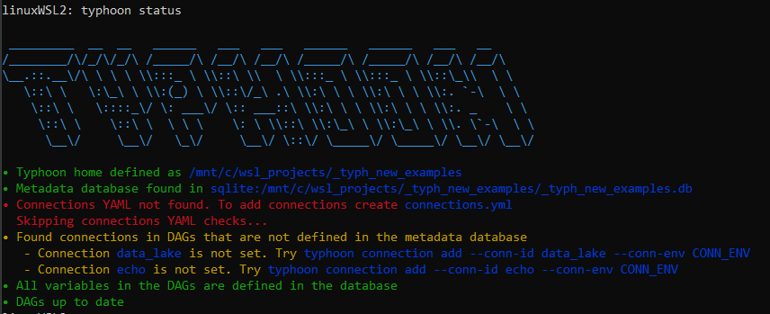
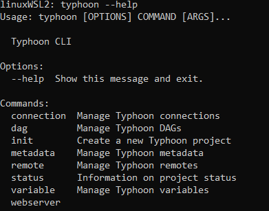
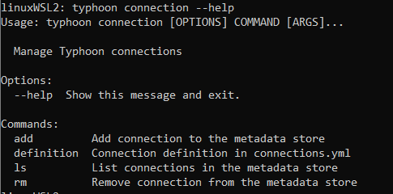
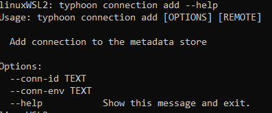
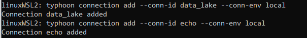
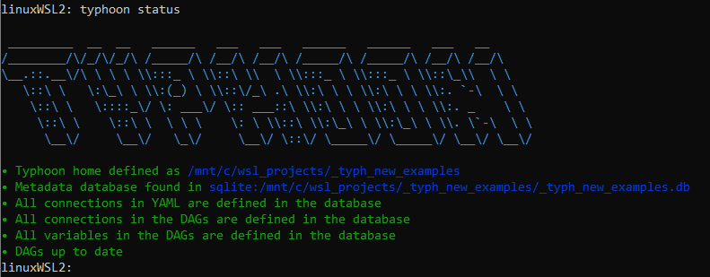
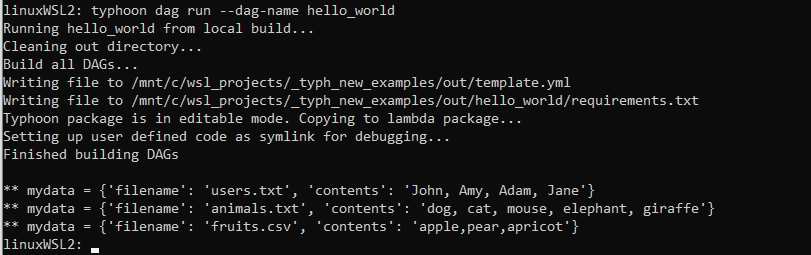
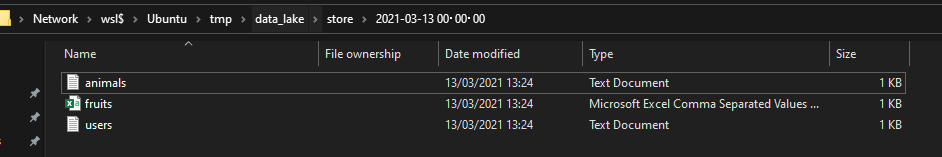

# Hello World - a ***non-trivial*** example

This tutorial will take you through how to write a simple (but non-trivial) Hello World example. 

This is the final DAG we will build. We will step through each part below. The DAG takes a YAML list of dictonaties (our data) and writes each dictionary to a file. It stores the file by run_date (hourly).

```yaml
name: hello_world
schedule_interval: rate(1 hours)
granularity: hour

tasks:
  send_data:
    function: typhoon.flow_control.branch
    args:
      branches:
        - filename: users.txt
          contents: John, Amy, Adam, Jane
        - filename: animals.txt
          contents: dog, cat, mouse, elephant, giraffe
        - filename: fruits.csv
          contents: apple,pear,apricot

  write_data:
    input: send_data
    function: typhoon.filesystem.write_data
    args:
      hook: !Hook data_lake
      path: !MultiStep
        - !Py $BATCH['filename']
        - !Py $DAG_CONTEXT.interval_end
        - !Py f'/store/{$2}/{$1}'
      data: !Py $BATCH['contents']
      create_intermediate_dirs: True
```

## Creating a Task

```yaml
name: hello_world
schedule_interval: rate(10 minutes)
granularity: hour
```

Very simply this sets you flow name (no spaces) and the schedule interval in a [rate](https://docs.aws.amazon.com/lambda/latest/dg/services-cloudwatchevents-expressions.html) to run at. It will use a timestamp truncated to the hour for the intervals.

```yaml
tasks:
  send_data:
    function: typhoon.flow_control.branch
    args:
      branches:
        - filename: users.txt
          contents: John, Amy, Adam, Jane
        - filename: animals.txt
          contents: dog, cat, mouse, elephant, giraffe
        - filename: fruits.csv
          contents: apple,pear,apricot
```

Here we are setting up our **`tasks`** in our flow. This is a DAG structure similar to many other workflow tools (e.g. Task A → Task B → Task C). 

Lets examine our first task, `send_data`, which simply outputs 3 'files' containing CSV formatted strings represented as a YAML list of dictionaries. We use `flow_control.branch` to yield our 3 branches to the next node.

## Connections & `typhoon status`

Lets start now by building this very basic task, and inspecting the output using a few options. 

First in your terminal, in the directory you have initialised your project, use typhoon-cli to run `typhoon status`.




We encourage you to run this after your steps to see if any errors, or unset variables are there. 

Here we can see that we are initially missing a connection file without connections so lets add this. 

You need to add a `connections.yml` file to the root directory of your typhoon project.

In this case we are calling our `data_lake` which is a local filesystem in `local` and a cloud S3 bucket in `prod`. To choose our environment we simply swap connections. We will also add an echo connection which we will use in a moment. 

```yaml
echo:
  local:
    conn_type: echo
    
data_lake:
  prod:
    conn_type: s3
    extra:
      base_path: /
      bucket: test-corp-data-lake
      region_name: eu-west-1
      login: <your login>
      passowrd: <your key>

  local:
    conn_type: local_storage
    extra:
      base_path: /tmp/data_lake
```

Now we have this lets add our missing connections.

We can get help on the client by using `typhoon —-help`



And then `typhoon connection -—help` 



Finally, we can use `typhoon connection add --help`



So now we can see how to add our connections from the `connections.yml`file. 

`typhoon connection add --conn-id data_lake --conn-env **local**`

`typhoon connection add --conn-id echo --conn-env **local**`



Now again `typhoon status`



*A Ok!*

## Build, Run and debug

Let's build our hello_world DAG and see some output. As a quick way lets add on echo task after our send_data task:

```yaml
  echo_my_output:
    input: send_data
    function: typhoon.debug.echo
    args:
      mydata: !Py $BATCH
```

$BATCH is the data packet as a consistent default reference. 

It can be any type so depending on your data can be shaped differently. e.g. $BATCH['key], $BATCH[0]  etc.

**Lets build it in typhoon-cli!** We can skip the help as you can now navigate the cli help the same way as for connections (*hint:* `typhoon dag --help`)

`typhoon dag build hello_world`

... **and run it** 

`typhoon dag run --dag-name hello_world`



Output of the YAML list as a list of dictionaries 

Now we can see what will be passed to the next node (which in our case is just echoing to the prompt). 

## Writing to a file

```yaml
  write_data:
    input: send_data
    function: typhoon.filesystem.write_data
    args:
      hook: !Hook data_lake
      path: !MultiStep
        - !Py $BATCH['filename']
        - !Py $DAG_CONTEXT.interval_end
        - !Py f'/store/{$2}/{$1}'
      data: !Py $BATCH['contents']
      create_intermediate_dirs: True
```

Our next task `write_data` receives each branch (asynchronously - more on this later for performance) from its `input` task. Setting a task as an input creates an edge for the data to flow linking them:

`send_data` `→` `write_data`

Next you notice we are writing to a filesystem using a standard python function `filesystem.write_data`.  Into this function we are passing 3 arguments, the connection hook, a transformation of the data, and the path (similar to airflow ones - reusable?),  

## Introducing our built in context variables

- $BATCH:    This is the data package passed to the next node.
- $BATCH_NUM:    This is the iterator number if you are batching (queries for example).
- $HOOK:    This represents your hook - you can use `!Hook my_conn` as syntax sugar or `!Py $HOOK.myconn`
- $VARIABLE:    This is how you can access saved variables e.g. lists of tables, query templates etc. An example might be `!Py $VARIABLE.mysql_read_3.format(table_name=$BATCH)`
- $DAG_CONTEXT.interval_start & $DAG_CONTEXT.interval_end:     Execution interval for example:
    - $DAG_CONTEXT.interval_start → '2021-05-23 10:00:00'     (inclusive)
    - $DAG_CONTEXT.interval_end → '2021-05-23 11:00:00'     (exclusive)

## Passing data

- The notation `!Py` indicates that what comes after is evaluated as normal python code.
- $BATCH is the data packet as a consistent default reference. It can be any type so depending on your data can be shaped differently e.g. $BATCH['key], $BATCH[0]  etc.

In our case remember each branch yields a list of dictionaries with two keys

`[{'filename': 'users.txt', 'contents':'['John', 'Amy', 'Adam', 'Jane']},{'filename':...}]`

The most complex item here is a `!Multistep` process showing how you can do multiple small python transformations in series in a a nice readable way (or you can put it in one line of course):

1. `!Py $BATCH['filename']`  will evaluate to "users.txt'
2. `!Py $DAG_CONTEXT.interval_end` will evaluate to the timestamp of the DAG run. This is a built in context variable. 
3. `!Py f'/store/{$2}/{$1}'` finally this references the first two lines (1, 2) and uses a normal [Python f-string](https://realpython.com/python-f-strings/) to make the path. Evaluating to '/store/ 2021-03-13T12:00:00/users.txt'

Lastly we want to deliver the right data, which is the 'contents' key:

`data: !Py $BATCH['contents']`

Here is our result!



Animals and fruits, along with our users!