# MySql to Snowflake

Now we know the basics, lets make something more useful.

For brevity the full connections YAML is included below for you to copy and replace your keys. However, we will be quite thorough to make sure each step is clear.

In this example, I need to take two tables `['clients', 'sales']` from our production MySql (replace with your favourite RDBMS) to Snowflake (replace with your favourite cloud DWH). Sample data for MySQL is included at the bottom.

We are going to load our data into a VARIANT field in Snowflake as this pattern is *very fault tolerant*.

!!! tip
    You can run a MySQL instance in docker with:

    ```
    docker run --name typhoon-example-mysql -e MYSQL_ROOT_PASSWORD=my-secret-pw -e MYSQL_USER=typhoon -e MYSQL_PASSWORD=typhoon -e MYSQL_DATABASE=prod_web_ecom -d -p "3306:3306" mysql

    docker exec typhoon-example-mysql mysql --user typhoon -ptyphoon --database=prod_web_ecom -e "CREATE TABLE clients (name text, age integer)"
    docker exec typhoon-example-mysql mysql --user typhoon -ptyphoon --database=prod_web_ecom -e "INSERT INTO clients(name, age) VALUES ('Tom', 27), ('Mary', 25)"
      
    docker exec typhoon-example-mysql mysql --user typhoon -ptyphoon --database=prod_web_ecom -e "CREATE TABLE sales (item text, amount integer)"
    docker exec typhoon-example-mysql mysql --user typhoon -ptyphoon --database=prod_web_ecom -e "INSERT INTO sales(item, amount) VALUES ('Phone', 600), ('Camera', 125)"
    ```

**Overview of what we want to do:**

1. List the tables from Typhoon variables.
2. Extract each table from MySQL
3. Write each table to S3 in JSON
    1. Creating a function to output to JSON
    2. Switching our connection to S3
4. Copy the files into snowflake

**DAG**: `list_tables`→ `extract_tables`→ `write_data_S3`→ `copy_to_snowflake_stage`

We will learn how to sample and test the flows as we build. Here is the final expected output: 

```yaml
name: dwh_flow
schedule_interval: rate(1 hours)
granularity: hour

tasks:
  list_tables:
    function: typhoon.flow_control.branch
    args:
      branches:
        - clients
        - sales

  extract_tables:
    input: list_tables
    function: typhoon.relational.execute_query
    args:
      hook: !Hook transaction_db
      batch_size: 10
      query_params:
        interval_start: !Py $DAG_CONTEXT.interval_start
        interval_end: !Py $DAG_CONTEXT.interval_end
      metadata:
        table_name: !Py $BATCH
      query: !MultiStep
        - !Py table_name=$BATCH
        - !Py f"SELECT * FROM {table_name} where creation_timestamp between %(interval_start)s and %(interval_end)s"

  write_data_S3:
    input: extract_tables
    function: typhoon.filesystem.write_data
    args:
      hook: !Py $HOOK.data_lake
      data: !Py transformations.data.list_of_tuples_to_json(list($BATCH.batch), $BATCH.columns)
      path: !Py f"data_{$BATCH.metadata['table_name']}_batch_num_" + str($BATCH_NUM) + "_" + str($DAG_CONTEXT.interval_end).replace(":", "_") + ".json"
      metadata: !Py $BATCH.metadata

  copy_to_snowflake_stage:
    input: write_data_S3
    function: typhoon.snowflake.copy_into
    args:
      hook: !Py $HOOK.snowflake
      table: !Py $BATCH.metadata['table_name']
      stage_name: stagetestcorpdatalake
      s3_path: ''
```

Lets create a file in the /my_project_root/dags folder called `dwh_flow.yml` .

## List_tables

```yaml
name: dwh_flow
schedule_interval: rate(1 hours)
add granularity: hour

tasks:
  list_tables:
    function: typhoon.flow_control.branch
    args:
      branches:
        - clients
        - sales

  echo_my_tables:
    input: list_tables
    function: typhoon.debug.echo
    args:
      mydata: !Py $BATCH
```

*Life is simple when you only have two tables - if only!*

Let's extract these hourly. We will improve this with variables later. 

Let's run `typhoon status` and run it:

`typhoon dag run --dag-name dwh_flow`

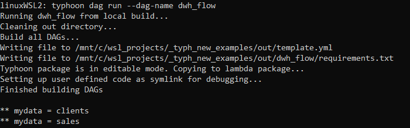

You can see we are simply outputting the tables in the list. 

## Extracting from MySQL

```yaml
  extract_tables:
    input: list_tables
    function: typhoon.relational.execute_query
    args:
      hook: !Py $HOOK.transaction_db
      batch_size: 10
      metadata:
        table_name: !Py $BATCH
      query: !Py "SELECT * FROM {table_name}".format(table_name=$BATCH)
```

Ok, here there are a few things going on:

1. We are applying `relational.execute_query` on each table to query on our `$HOOK.transaction_db` connection. This is pointing to our MySQL database that records our customer transactions. 
2. We are saving the table names for use downstream in the flow in our `metadata` dictionary.
3. We are formatting our `query` using normal python. Again, later in this tutorial we will use ***Variables*** to store our dynamic SQL***.***

Ok, so we will output the whole table each hour. Perhaps *not so smart*, so lets add something more reasonable. 

```yaml
extract_tables:
    input: list_tables
    function: typhoon.relational.execute_query
    args:
      hook: !Hook echodb
      batch_size: 10
      query_params:
        interval_start: !Py $DAG_CONTEXT.interval_start
        interval_end: !Py $DAG_CONTEXT.interval_end
      metadata:
        table_name: !Py $BATCH
      query: !MultiStep
        - !Py table_name=$BATCH
        - !Py f"SELECT * FROM {table_name} where creation_timestamp between %(interval_start)s and %(interval_end)s"
```

Here we are making two changes. The obvious one is to apply the `$DAG_CONTEXT.interval_start` and `$DAG_CONTEXT.interval_end` as query parameters in the query (note its MySQL paramstyle). This means we will pull those transactions created within the hour interval. Much more sensible!

Note: you could of course treat this like the table as a string format (but not the other way around; you cannot use query parameters for the table or schema).  

The second thing is we are ***temporarily*** using a new hook: `echodb`. This is similar to our echo task but will show us the sql that would be passed to MySQL. We need to add the connection (make sure its in the connection.yml which is available to copy at the bottom).

`typhoon connection add --conn-id echodb --conn-env local`

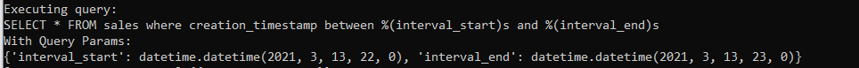

Looks correct SQL. 

Remember to change your hook back to 
    `hook: !Py $HOOK.transaction_db`

Lets add our Mysql hook and run to an echo task: 

`typhoon connection add --conn-id transaction_db --conn-env prod`

Because we are developing we might want to select a specific execution date:

`typhoon status`

`typhoon dag run --dag-name dwh_flow --execution-date 2021-05-20T14:00:00`

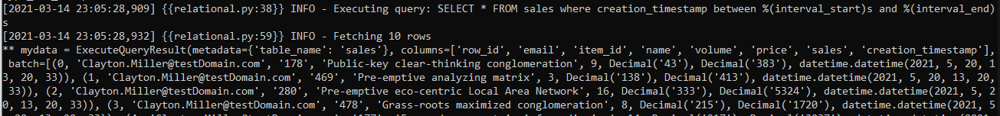

Our (faked) data from the MySql echoed 

Do so now its outputting our selected tables within the time interval in batches of 10 rows (of course you would raise this). Next lets land this in files to S3. 

## Write each table to S3 in JSON

```yaml
write_data_S3:
    input: extract_tables
    function: typhoon.filesystem.write_data
    args:
      hook: !Py $HOOK.data_lake
      data: !Py $BATCH.batch
      path: !Py f"data_{$BATCH.metadata['table_name']}_batch_num_" + str($BATCH_NUM) + "_" + str($DAG_CONTEXT.ts).replace(":", "_") + ".json"
      metadata: !Py $BATCH.metadata
```

*Ok, now its starting to look familiar (I hope).*

Our function `filesystem.write_data` will write to a filesystem. Notice this is the ***same*** connection YAML used in hello_world. All our functions, connections and components are re-usable. Lets start with the local environment to test it to a local filepath. 

`typhoon connection add --conn-id data_lake --conn-env local`

Running this we should now see the following (see the connection for where this will land):

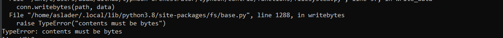

So we must transform the data to bytes. In fact we need to write it into JSON so that we can use Snowflake's VARIANT column for ingestion. We strongly recommend this pattern. We are passing this function data from the `extract_tables` task above. MySQL outputs some tuples so we need a transformation function that will turn these tuples into JSON (1 JSON object per row). 

## (Optional) reating a function to output to JSON

!!! info 
    This step is optional as it already is included in typhoon. So its only to illustrate how to roll your own function.

So, let's make our own function for this. In the transformations folder we can add function to the data file (or you can make a new one):

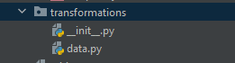

Typhoon is easily extensible.

```python
from io import StringIO, BytesIO
from typing import Union
import simplejson as json

def list_of_tuples_to_json(data: Union[list], field_names: list):    
    list_of_dicts = [dict(zip(field_names, tup)) for tup in data]
    d_out = BytesIO()
    for d in list_of_dicts:
        d_out.write(json.dumps(d, cls=TestEncoder, namedtuple_as_object=True).encode())
    d_out.seek(0)
    return d_out
```

Then we can call this in the DAG by replacing `data` with:

`data: !Py transformations.data.list_of_tuples_to_json(list($BATCH.batch), $BATCH.columns)`

So now, before we write to the file we are transforming our tuples to return rows of json doc as bytes. 

Building and running the DAG now gives us:

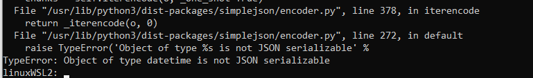

So lets see how we can debug the Python code directly. One key advantage of developing in Typhoon is that the YAML compiles to very readable, normal python functions. You can debug in an IDE of your choice as normal or run from prompt.

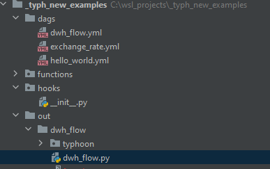

Building a DAG compiles to the 'out' folder

Note that we can set the example task to debug with in **`dwh_flow.py`**. For example here we are setting a test execution date. by altering the example_event datetime. 

```python
if __name__ == '__main__':
    import os

    example_event = {
        'time': '2021-05-20T14:00:00Z'
    }
    example_event_task = {
        'type': 'task',
        'dag_name': '',
        'task_name': 'list_tables_branches',
        'trigger': 'dag',
        'attempt': 1,
        'args': [],
        'kwargs': {
            'dag_context': DagContext.from_cron_and_event_time(
                schedule_interval='rate(1 hours)',
                event_time=example_event['time'],
                granularity='hour',
            ).dict()
        },
    }

    dwh_flow_main(example_event, None)
```

We can find the point in the code that is relevant for our JSON

```python
config['data'] = transformations.data.list_of_tuples_to_json(list(batch.batch), batch.columns)
```

So you can develop your function to correctly encode the datetime: 

```python
from io import StringIO, BytesIO
from typing import Union
import pandas as pd
import simplejson as json
from datetime import datetime

class DateTimeEncoder(json.JSONEncoder):
    def default(self, obj):
        if hasattr(obj, 'isoformat'):
            return obj.isoformat()
        else:
            return json.JSONEncoder.default(self, obj)

def list_of_tuples_to_json(data: Union[list], field_names: list):
    list_of_dicts = [dict(zip(field_names, tup)) for tup in data]
    d_out = BytesIO()
    for d in list_of_dicts:
        d_out.write(json.dumps(d, cls=DateTimeEncoder, namedtuple_as_object=True).encode())
				d_out.write(str('\n').encode())
    d_out.seek(0)
    return d_out
```

Then we should add this to our YAML:

`data: !Py transformations.data.list_of_tuples_to_json(list($BATCH.batch), $BATCH.columns)`

This is passing $BATCH.batch and the $BATCH.columns to this function that we will add. It is very simply transforming tuples from the resultset to JSON using our new function above. 

Now if we run it again, either in the cli or the **`dwh_flow.py`** directly we should get an output to our local filesystem like:

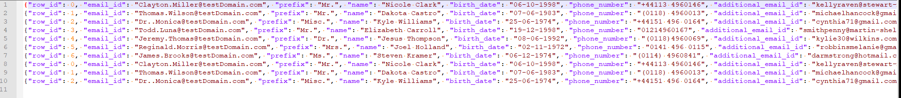

Our (fake) data exported as JSON in batches of 10 rows

## Switching to S3

The final step of this section is to switch the connection to our S3 bucket (i.e. production): 

`typhoon connection add --conn-id data_lake --conn-env prod`

When we re-run the DAG we will see the results are now landing in S3 (see YAML connections at end of this for hints on getting the connection right). 

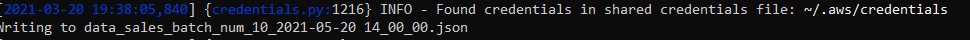

And in the bucket :

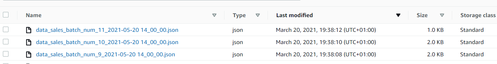

## Copy data to Snowflake

Ok, now for the final step - we need to upload these files to snowflake. To prepare snowflake to receive from S3 [you need to set up an S3 Stage](https://docs.snowflake.com/en/user-guide/data-load-s3-config.html) [( See Snowflake docs)](https://docs.snowflake.com/en/user-guide/data-load-s3-config.html).

Let's add our final task to the DAG YAML:

```yaml
copy_to_snowflake_stage:
    input: write_data_S3
    function: typhoon.snowflake.copy_into
    args:
      hook: !Py $HOOK.snowflake
      table: !Py $BATCH.metadata['table_name']
      stage_name: stagetestcorpdatalake
      s3_path: ''
```

Before we run it we need to create our staging tables. We are using a VARIANT loading field to land the data: 

```sql
CREATE OR REPLACE TABLE clients (
    data_var variant,
    etl_id varchar(100),
    etl_timestamp datetime,
    etl_filename varchar(100)
)
;

CREATE OR REPLACE TABLE sales (
    data_var variant,
    etl_id varchar(100),
    etl_timestamp datetime,
    etl_filename varchar(100)
)
;
```

We need to add our connection (see YAML at the end for the connection):

`typhoon connection add --conn-id snowflake --conn-env prod`

`typhoon dag run --dag-name dwh_flow --execution-date 2021-05-20T14:00:00`

**... and we have data in Snowflake!**

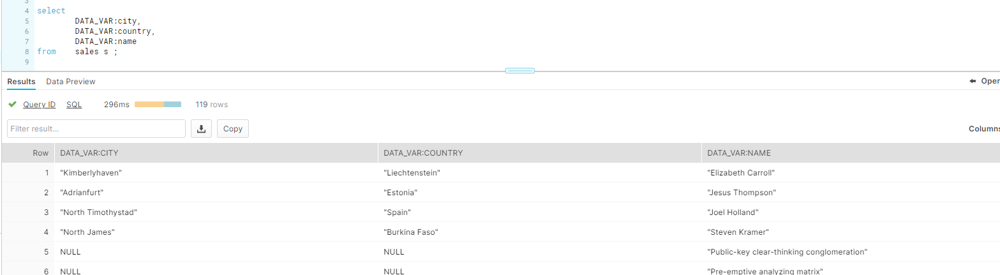


!!! info "Some potential optimisations"
    - We are running COPY for each file we land. This isn't optimal, even though snowflake is protecting against duplicating the data. We can tackle this chaining together DAGS by writing a 'success file' .
    - Listing tables in a variable
    - More templating
    - **Creating a Component!**

We will cover these in other blogs. For now...well done you made it!


## Helper Assets

### YAML connections

```yaml
echo:
  local:
    conn_type: echo

echodb:
  local:
    conn_type: echodb
    schema: main

data_lake:
  prod:
    conn_type: s3
    extra:
      base_path: /
      bucket: your-bucket-here
      region_name: your-region-here
      login: SECRETLOGIN
      passowrd: SECRETKEY

  local:
    conn_type: local_storage
    extra:
      base_path: /tmp/data_lake

transaction_db:
  dev:
    conn_type: sqlite
    schema: main
    extra:
      database: /tmp/web_trans_local.db
  prod:
    conn_type: sqlalchemy
    login: your-login-name
    password: your-password
    host: localhost
    port: 3306
    schema: prod_web_ecom
    extra:
      dialect: mysql
      driver: mysqldb
      database: prod_web_ecom

snowflake:
  prod:
    conn_type: snowflake
    login: your-login
    password: your-password
    schema: staging
    extra:
      account: your-account
      region: your-region
      database: your-db
      warehouse: WAREHOUSE_NAME
      role: your-role
```

### Mock data
[Sample MySQL Data.zip](https://s3-us-west-2.amazonaws.com/secure.notion-static.com/b609b5d1-6ed0-4803-9d94-eedd1cb248f7/Sample_MySQL_Data.zip)