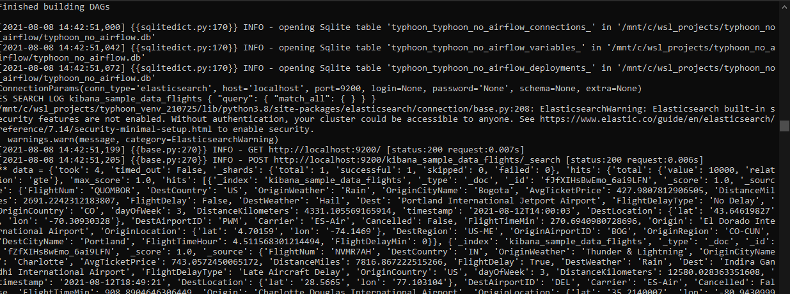

# Hooks - Connection interfaces

Typhoon hooks represent the same thing as [airlflow hooks][1], so if you are familiar it's an easy concept. They are the interface to external platforms and databases.

### Why create a new Hook? 

You may want to access data sources or APIs that don't exist already in any of:

   - Core or Community contributed [Typhoon Hooks][3]  
     - File system, AWS, Snowflake
   - [SQLAlchemy][5] / [Python DB API 2.0][4] allowing hundreds of DBs without much custom code.
   - [Singer taps][2]. You can use any singer taps in your DAG as a task.   

To understand how to add a connection using an existing hook see [Adding connections][2].

[1]:https://airflow.incubator.apache.org/docs/apache-airflow/2.0.0/concepts.html?highlight=hooks
[2]:connections.html
[3]:/usage/hooks.html
[4]:https://www.python.org/dev/peps/pep-0249/
[5]:https://docs.sqlalchemy.org/en/14/dialects/


## Creating New Hooks

If you need to make a new one its relatively straightforward. Let's make an example to get data from elasticsearch. 
      
### Installing Es and Kibana & adding sample data

Follow along here [Docker and Elastic][6]. You need Docker Desktop.  There is an option to add data when you load Kibana browser UI. 

### Creating the Hook interface

You can publish new Hooks to the community in their own repo. Here we will just make one locally. 

First we will make go to the project folder of our typhoon $TYPHOON_HOME and create a file called `elastic.py` in the folder `hooks` (under the root folder). This will establish the interface. 

In this example we will ignore the security for brevity, but you can add login and passwords or secret keys easily in the same way.

All Hooks extend the `HookInterface` and have 3 functions:
 - `__init__`
 - `__enter__`   - usually the only part to change to address teh specific connection of the DB. 
 - `__exit__` 

So in `__enter__` here we are adding our Elasticsearch package and setting up the paramaters from our `Connections.yml`. 

```python
from typhoon.contrib.hooks.hook_interface import HookInterface
from typhoon.connections import ConnectionParams

class ElasticsearchHook(HookInterface):
    conn_type = 'elasticsearch'

    def __init__(self, conn_params: ConnectionParams, conn_type: str = 'client'):
        self.conn_params = conn_params
        self.conn_type = conn_type

    def __enter__(self):
        from elasticsearch import Elasticsearch

        conn_params = self.conn_params
        credentials = {
            'host': conn_params.host,
            'port': conn_params.port
        }
        self.es = Elasticsearch([credentials])
        return self.es

    def __exit__(self, exc_type, exc_val, exc_tb):
        self.es = None
```

### Creating hook functions

In this case we will only make the search function. You can of course add whatever you need, even combining other libraries (e.g. returning a Pandas Dataframe). 

In the functions folder (from root) of your project add `elastic_functions.py`. As you can see, this is very straightforward where we are just wrapping the hook and the elasticsearch search function. 

```python
from elasticsearch import Elasticsearch
from typing import Optional, List

from hooks.elastic import ElasticsearchHook

# .search(index="sw", body={"query": {"match": {'name':'Darth Vader'}}})
def search(
        hook: ElasticsearchHook,
        index: str,
        body: Optional[str] = None,
):
    with hook as es:
        return es.search(index=index, body=body)


```

### Adding to `Connection.yml`

To your `Connections.yml` add:

```YAML
elastic_cluster:
  local:
    conn_type: elasticsearch
    host: localhost
    port: 9200
```
Note, you can add `login` and `password` and other `extra` attributes to the Hook and then add them here also.

In your console use the typhoon cli to add teh connection in the normal way 

- `typhoon status`
- `typhoon connection add --conn-id elastic_cluster --conn-env local`
- `typhoon status`  - to check its now resolved

### A test DAG

Finally, test this against your test data with a DAG called `elastic_query.yml` in the `dags` folder.

```YAML
name: elastic_query
schedule_interval: rate(10 minutes)

tasks:

  search_elastic:
    function: functions.elastic_functions.search
    args:
      hook: !Hook elastic_cluster
      body: '{
                "query": {
                  "match_all": { }
                }
              }'
      index: kibana_sample_data_flights

  echo_result:
    input: search_elastic
    function: typhoon.debug.echo
    args:
      data: !Py $BATCH
```

Then run with `typhoon dag run --dag-name elastic_query` in your project home with the Typhoon cli. 

You should see the data echo to the console ready to use in a pipeline.




[6]:https://www.elastic.co/guide/en/elasticsearch/reference/current/getting-started.html#run-elasticsearch