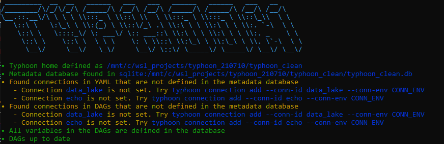

# Installation
Typhoon can be installed locally with pip or using docker. To test airflow (especially on Windows) we recommend using the docker version. 

!!! tip "Use the DEV version when installing it locally."
    The [dev] version comes with all the libraries and tools that make development easier.

        `pip install typhoon-orchestrator[dev]`

    The production version is lightweight for use with Lambda.


!!! note "[Hello World - 5 min walkthrough][2]"
    After installation we recommend following [Hello World][2] example. You can use the rest of 'Getting Started' section here for details in each step should you need it. 

## with pip 

Optionally -  Install and activate virtualenv
```bash
python3 -m venv typhoon_venv
source ./typhoon_venv/bin/activate
```

```bash
pip install typhoon-orchestrator[dev]

# Create a project
typhoon init hello_world

# Try the Cli
cd hello_world
typhoon status
```

Let's try our first steps adding a few connections. 
```bash
# Add your connection
typhoon connection add --conn-id data_lake --conn-env local
typhoon connection ls -l

# add the echo one too for completeness
typhoon connection add --conn-id echo --conn-env local
typhoon connection ls -l

#final check of status to show it's successfully been added.
typhoon status
```

<figure markdown> 
   { width="800" }
   <figcaption>`typhoon status` before you add your connections. It shows how to add them.</figcaption>
</figure>


!!! tip "Bash/ZSH/Fish auto-complete" 
    - bash eval "$(_TYPHOON_COMPLETE=source_bash typhoon)"
    - zsh eval "$(_TYPHOON_COMPLETE=source_zsh typhoon)"
    - fish eval "$(_TYPHOON_COMPLETE=source_fish typhoon)"


## With Docker and Airflow

To deploy Typhoon with Airflow you need: 

- Docker / Docker Desktop (You must use WSL2 or GitBash on Windows) 
- Download the [docker-compose.yaml][1]  (or use curl below)
- Create a directory for your TYPHOON_PROJECTS_HOME

The following sets up your project directory and gets the docker-compose.yml:
```bash
TYPHOON_PROJECTS_HOME="/tmp/typhoon_projects" # Or any other path you prefer
mkdir -p $TYPHOON_PROJECTS_HOME/typhoon_airflow_test
cd $TYPHOON_PROJECTS_HOME/typhoon_airflow_test

# For Windows WSL2 Users - for other env. its optional 
sudo chown -R $USER: $TYPHOON_PROJECTS_HOME/typhoon_airflow_test
mkdir airflow
mkdir data_lake
mkdir src

curl -LfO https://raw.githubusercontent.com/typhoon-data-org/typhoon-orchestrator/master/docker-compose-af.yml
```

!!! Important
    On Windows **WSL** please run each docker-compose run **one by one**. They are quick.

```bash
docker-compose -f docker-compose-af.yml run --rm typhoon-af airflow initdb
docker-compose -f docker-compose-af.yml run --rm typhoon-af typhoon status
docker-compose -f docker-compose-af.yml run --rm typhoon-af typhoon connection add --conn-id data_lake --conn-env local  # Adding our first connection!
docker-compose -f docker-compose-af.yml run --rm typhoon-af typhoon dag build --all
docker compose -f docker-compose-af.yml up -d
```

#### Checking Airflow UI

Then check the airlfow UI at [http://localhost:8088](http://localhost:8088)

This runs a container with only 1 service, `typhoon-af`. This has both Airflow and Typhoon installed on it ready to work with.

#### Directories
Some directories are mounted which synchronizes files between your computer and the container.

- ./data_lake - for landing files (as a local dev environment)
- ./airflow_dags - where typhoon compiles your Airflow DAGs to
- ./src - Your Typhoon project
- ./src/dags - Where you develop your Typhoon YAML DAGs

#### Development hints
So you should develop your dags in ./src/dags using your local editor (not within the container - the files sync).  

You then access the docker container `tyhpoon-af` to use typhoon 

```bash
docker exec -it typhoon-af bash
```

Inside the container bash:  
```bash
typhoon status
typhoon dag build --all
```

If they successfully compile they will appear in ./airflow_dags, and also in the Airflow UI.

**You may also need to restart the Airflow Container to see this list update.** 


!!! important "Next steps: add connections shown in typhoon status before running - [Hello World - 5 min walkthrough][2]"
    After installation we recommend following [Hello World][2] example. 
    This shows a ste-by-step of adding the connections, building and running our Hello World DAG.

    ```bash
    typhoon connection add --conn-id data_lake --conn-env local
    typhoon connection add --conn-id echo --conn-env local
    typhoon dag build --all
    ```

[1]:/docker-compose-af.yml
[2]:../examples/hello-world.md
[3]:/docker-compose-37-no-airflow.yml