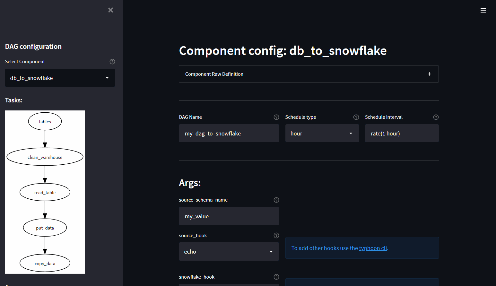

# Using the Component Builder UI

<figure markdown> 
   { width="800" }
   <figcaption>Team members can self-serve complex DAGs quickly.</figcaption>
</figure>

### Included components:

- **Glob & Compress**: To glob (e.g. '*.csv') files and compress them to gzip or zlib.  
- **FileSystem to DB**: To read (glob) files on a schedule into an existing table. 
- **DB to FileSystem**: To write a table to a file pattern. 
- **DB to Snowlfake**: Multiple tables landed to snowflake ([idempotent][3] with added DHW staging metadata). Fully end-to-end production ready flow. 

## Running the UI

In your terminal use 
```bash
    typhoon webserver 
```

Resulting in a message:

```bash
  You can now view your Streamlit app in your browser.

  Network URL: http://172.17.201.54:8501
  External URL: http://31.13.188.150:8501
```

## Using the UI

The UI uses the Typhoon API to configure a DAG that uses a particular Component.  

This means the result of the UI use will be a normal DAG that has been built. You can then review and edit this DAG file as normal. 

Use the dynamic form (main screen) to enter the arguements (hooks etc) as you need. Note, you must add any connections to the connections.yml and add the connection to Typhoon using the CLI. 

Then you must click the **'Create Dag'** button to generate the file and build it. 

The success notice includes the path of the yaml DAG file generated for minor editing, testing and use. 

## Glob & Compress

To glob (e.g. '*.csv') files and compress them to gzip or zlib.  

- source_hook:  FileSyestemHookInterface  (i.e. local file or S3 etc)
- destination_hook:  FileSyestemHookInterface
- pattern: str e.g. *.csv or a Jinja template that has been registered in Typhoon CLI
- destination_path: relative path to the hook root folder. 
- compression: limited by menu to gzip | zlib. 

## FileSystem to DB

To read (glob) files on a schedule into an existing table. 

- filesystem_hook: FileSystemHook
- pattern: str e.g. *.csv 
- db_hook: SQLAlchemyHook
- table_name: str

## DB to FileSystem

To write a single table to a file pattern. This is a whole table snapshot.  

- db_hook: DBApiHook
- table_name: str
- batch_size: int
- filesystem_hook: FileSystemHook
- path_template: str - very likely to be '{table}_{file_num}.csv' or similar.
- create_intermediate_dirs: true | false

## DB to Snowlfake

Multiple tables landed to snowflake ([idempotent][3] with added DHW staging metadata). Fully end-to-end production ready flow. 

- source_schema_name: str i.e. the db schema
- source_hook: DbApiHook
- snowflake_hook: SnowflakeHook
- source_tables: List[str]  - i.e. list all the tables in a Yaml string. 
- quote_tables: true | false