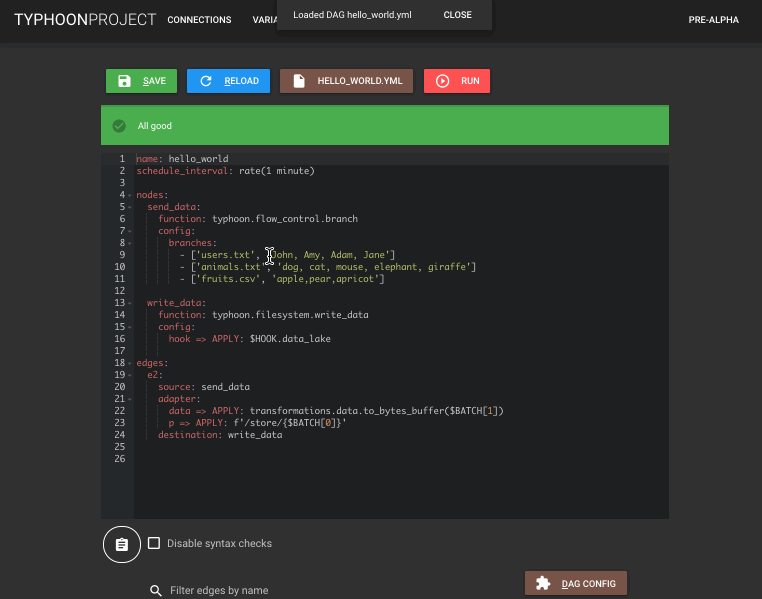
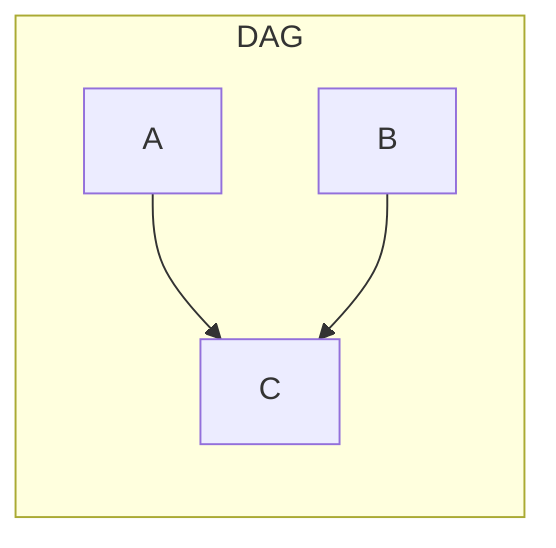

# Typhoon Orchestrator


Asynchronous serverless workflow scheduler and orchestrator that deploys to Amazon Web Services.

## What does that mean exactly?

Some examples of existing workflow schedulers are Airflow or Luigi. Like crontab, they launch tasks on a set schedule, but they can define task dependencies in the form of a directed acyclic graph (DAG). Unlike the previous examples Typhoon deploys to AWS cloud for easy deployment and infinitely scalable workflows.

## Key principles

- **Composability**: Every piece in Typhoon is designed to do one and only one thing well and be easy to reuse across DAGs.
- **Data sharing**: In order to achieve reusability of components, nodes need to be able to share data **at runtime** with other nodes they're connected to (ie: there's an edge from one to the other). Here we depart from Airflow's design where all configuration data is given at DAG definition time and unless you use XCom, which is not recommended, nodes don't communicate with each other.
- **Simplicity (+ no lock-in!)**: Nodes are just Python functions. Test your code without importing Typhoon at all. No mocks, no set up of complex contexts. Reuse your code painlessly or migrate it away from Typhoon with ease if you ever choose to do so.
```python
def write_to_path(data: str, path: str) -> str:
    """Node function that writes a string to a specified path"""
    with os.open(path, 'w') as f:
        f.write(data)
    return path
```
- **Easy production deployment**: Use our CLI to deploy to AWS in minutes.
```bash
# Add a remote for deployment (you only need to do it once)
typhoon remote add prod --aws-profile my-aws --metadata-db-url dynamodb:Host=dynamodb.us-west-1.amazonaws.com;Region=us-west-1
# Create all the necessary tables in the metadata database (only need to do it once but it's idempotent)
typhoon metadata migrate prod
# Deploy all DAGs to our test remote
typhoon dag push prod --all
```
- **Scalable**: Use it to schedule your quick scripts on Amazon Web Services using just the AWS free tier, or have thousands of DAGs at the same time running hundreds of tasks each in parallel due to its asynchronous serverless design.
- **Separation of concerns**: Nodes are Python functions that deal with arguments. DAGs have an execution context that can be used to construct those arguments. No more mixing scheduler specific classes with business logic with retrieving information from the execution context.
- **Rich CLI**: Inspired by other great command line interfaces, it will be instantly familiar to *nix and git users. Intelligent bash/zsh completion.
```bash
typhoon init test_project
typhoon status
typhoon dag ls -l
typhoon dag push test --dag-name example_dag
```
- **Sleek and modern**: Heavily uses Python typing, deploys to cloud, has a rich CLI and a beautiful (but experimental) Web UI.



## Enough talk, show me the code

### DAG definition
**Non-trivial example, for a gentle introduction check out the getting started section**
We want to create a workflow that executes every day at 9pm, extracts data from 3 tables named person, job, and property from a database, then writes it in CSV form to S3. The definition for this DAG might be as follows:

```yaml
name: example_dag
schedule_interval: '0 21 * * *'  # Run every day at 21:00

nodes:
  send_table_names:
    function: typhoon.flow_control.branch
    config:
      branches:
        - person
        - job
        - property

  extract_table:
    function: typhoon.relational.execute_query
    config:
      hook: $HOOK.test_db

  load_csv_s3:
    async: false        # The table may be large, it doesn't make sense to serialize each batch and send asynchronously
    function: typhoon.filesystem.write_data
    config:
      hook: $HOOK.s3_data_lake


edges:
  send_extraction_params:
    source: send_table_names
    adapter:
      table_name => APPLY: $BATCH
      query => APPLY:
        - str("SELECT * FROM {{ table_name }} WHERE creation_date='{{ date_string }}'")
        - typhoon.templates.render(template=$1, table_name=$BATCH, date_string=$dag_context.ds)
      batch_size: 200
    destination: extract_table

  table_to_s3:
    source: extract_table
    adapter:
      data => APPLY:
        - typhoon.db_result.to_csv(description=$BATCH.columns, data=$BATCH.batch)
        - $1.encode('utf_8')
      path => APPLY:
        - str('{{system}}/{{entity}}/{{dag_cfg.ds}}/{{dag_cfg.etl_timestamp}}_{{part}}.{{ext}}')
        - typhoon.templates.render($1, system='postgres', entity=$BATCH.table_name, dag_cfg=$dag_context, part=$BATCH_NUM, ext='csv')
    destination: load_csv_s3
```

### Node function

The write_data function would be implemented as follows:
```python
def write_data(data: BytesIO, hook: FileSystemHookInterface, path: str) -> str:
   with hook:
       hook.write_data(data, path)
   return path
```
In addition, functions can also yield batches instead of returning, and each batch will be processed in parallel.

### FAQs (actually no one asked yet but ¯\\_(ツ)_/¯)
#### Why not use Python to define DAGs?

Our goal was to cut away all boilerplate and this was not possible to do as just a Python library. In addition, we built our editor in the Web UI (not stable yet) which provides much deeper insight into the DAGs than a general purpose code editor could, as well as real-time rendering of a DAG representation and testing of expressions in adapters. You can also still use your favourite editor and get some code complete/hints by configuring our bundled JSON schema. Some additional advantages are that a YAML file is also fammiliar to many coders, readable and much easier to generate automatically.

#### Unlimited parallelism? Can't this DDOS my database/server?

Yep, this project is still in early development so in the mean time either limit the amount of simultaneous executions your lambda can run or set your edges to `async: False` if this is a concern.

#### Isn't it better to isolate tasks and not share data like Airflow does?

As with everything, different designs have different tradeoffs. The tradeoff with Airflow's task isolation is that there is more coupling between tasks and with context. This sounds counter-intuitive but take a look at existing Airflow operators. What in Typhoon would be a generic "extract from database" task and "insert into a filesystem" task, in Airflow is a PostgresToS3task, PostgresToFTP, MySQLToS3 etc. Iroincally by isolating tasks we have increased coupling and crippled task re-usability.

#### What is Typhoon's tradeoff?

The tradeoff is that a little more thought needs to be put into how to construct a DAG from existing parts and making them fit together. The upside is that each part is likely to already exist to be well tested so it should cut down development complexity and time. In the future we may allow the definition of "components" which encapsulate a group of nodes and edges, making it easy to reuse the same pattern in different DAGs.

#### Anything else I should know if I'm coming from Airflow?

Yes, the biggest difference is that edges in Typhoon have a different meaning than in Airflow. In airflow edges mean a dependency between two tasks. The second will not start until the first one finishes. On the other hand, in Typhoon they signify a flow of data between nodes. Let's look at this with an example:



- In Airflow this means that task C executes only when both task A and task B have finished executing.
- In typhoon this means that whenever task A or B produce a batch, task C will execute with that batch as input.

### What are the limitations of the project

Right now the project is evolving fast but is still lacking some important features compared to Airflow and others.

- It does not yet have monitoring capabilities. Future releases will have this but just use Cloudwatch for now.
- It does not have an equivalent to Sensors in Airflow.
- It does not have connection pools to limit parallelism (limit lambda concurrency for now).
- Lambda's 15 minute timeout. We will allow longer tasks to run on Fargate in the future.

### What is the future of the project?

If there is interest I intend to develop it to feature parity with Airflow and beyond. Some cool things we could get for free by running on AWS are workflows triggered by events instead of on a schedule. Eg: Different DAGs could move data to S3 and this could generate an event that triggers an "S3 to Data Lake" DAG instead of repeating the S3 to data lake logic on each DAG.
