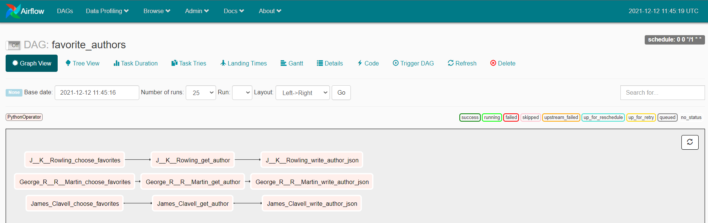

---
hide:
  - navigation
---

<div class="header_sidebyside"></div>

<div class="header_sidebyside"><b>Elegant YAML DAGS for Data Pipelines</br>Deploy to Airflow or AWS Lambda.</b></div>

# 

=== "Why Typhoon"

    *Write Airflow DAGS faster* :rocket:

    **Write Serverless AWS Lambda  DAGS faster** :rocket: :rocket:

    Make creating reliable data pipelines easy for the whole team :raised_hands:

    Simplicity and re-usability; a toolkit designed to be loved by Data Engineers :heart:

    Deploying to your existing Airflow with zero risk and no migration work :relaxed:

    **Workflow**: Typhoon YAML DAG --> transpile --> Airflow DAG 


=== "Key Principles"

    - **Elegant**:  YAML; low-code and easy to pick up.
    - **Data sharing** - data flows between tasks making it intuitive and easy to build tasks.
    - **Composability** - Functions combine like Lego. Effortless to extend for more sources and connections.
    - **Components** - reduce complex tasks (e.g. CSV→S3→Snowflake) to 1 re-usable task.
    - **UI**: Component UI for sharing DAG configuration with your DWH, Analyst or Data Sci. teams.
    - **Rich Cli**: Inspired by other great command line interfaces and instantly familiar. Intelligent bash/zsh completion.
    - **Testable Tasks** - automate DAG task tests.
    - **Testable Python** - test functions or full DAGs with PyTest.
    - **Flexible deployment**: deploy to Airflow - large reduction in effort, without breaking existing production.

=== "Layers" 

    - **Pristine**: Pre-built (OSS) components and UI that can be shared to your team    
    - **Core**: Python (OSS) core 
        - Extensible and hackable. 
        - Components allow you to share extensions widely in the Pristine layer


!!! note "[Installing Typhoon - quick start][1]"

!!! note "[Hello World - 5 min walkthrough][2]"

[1]:./getting-started/installation.md
[2]:./examples/hello-world.md

## Example DAG


=== "Typhoon DAG (YAML)"

    ```yaml linenums="1"
      name: favorite_authors
      schedule_interval: rate(1 day)
      
      tasks:
        choose_favorites:
          function: typhoon.flow_control.branch
          args:
            branches:
              - J. K. Rowling
              - George R. R. Martin
              - James Clavell
      
        get_author:
          input: choose_favorites
          function: functions.open_library_api.get_author
          args:
            author: !Py $BATCH
      
        write_author_json:
          input: get_author
          function: typhoon.filesystem.write_data    
          args:
            hook: !Hook data_lake
            data:  !MultiStep
              - !Py $BATCH['docs']
              - !Py typhoon.data.json_array_to_json_records($1)
            path: !MultiStep 
              - !Py $BATCH['docs'][0]['key']
              - !Py f'/authors/{$1}.json'
            create_intermediate_dirs: True

    ```

=== "Equivalent Airflow DAG (python)"

    ```python linenums="1"
    import datetime

    import typhoon.contrib.functions as typhoon_functions   # for a fair comparison
    import typhoon.contrib.transformations as typhoon_transformations
    from airflow import DAG
    from airflow.hooks.base_hook import BaseHook
    from airflow.operators.python_operator import PythonOperator
    
    from functions import open_library_api
    from out.new_people.typhoon.contrib.hooks.filesystem_hooks import LocalStorageHook
    
    
    def get_author(author: str, **context):
        result = open_library_api.get_author(
            requested_author=author,
        )
        context['ti'].xcom_push('result', list(result))
    
    def write_author_json(source_task_id, **context):
        conn_params = BaseHook.get_connection('data_lake')
        hook = LocalStorageHook(conn_params)       # Note how we're hardcoding the class
        create_intermediate_dirs = True
    
        batches = context['ti'].xcom_pull(task_ids=source_task_id, key='result')
        for batch in batches:
            data = typhoon_transformations.data.json_array_to_json_records(batch['docs'])
            _key = batch['docs'][0]['key']
            path = f'/authors/{_key}.json'
            typhoon_functions.filesystem.write_data(
                hook=hook,
                data=data,
                path=path,
                create_intermediate_dirs=create_intermediate_dirs,
            )
    
    with DAG(
        dag_id='favorite_authors',
        default_args={'owner': 'typhoon'},
        schedule_interval='*/1 * * * *',
        start_date=datetime.datetime(2021, 3, 25, 21, 10)
    ) as dag:
        for author in ['J. K. Rowling', 'George R. R. Martin', 'James Clavell']:
            get_author_task_id = f'get_author_{author}'
            get_author_task = PythonOperator(
                task_id=get_author_task_id,
                python_callable=get_author,
                op_kwargs={
                    'author': author,
                },
                provide_context=True
            )
            dag >> get_author_task
    
            write_author_json = PythonOperator(
                task_id=f'write_author_json_{author}',
                python_callable=write_author_json,
                op_kwargs={
                    'source_task_id': get_author_task_id,
                },
                provide_context=True
            )
            get_author_task >> write_author_json

    ```

<figure markdown> 
   { width="400" }
   <figcaption>Getting the works of my favorite authors from Open Library API</figcaption>
</figure>

## Using with Airflow

First, read our [installation][1] docs to get going with airflow + docker (10 mins).

Building the above DAG using 

```bash
docker-compose -f docker-compose-af.yml run --rm typhoon-af typhoon dag build --all
docker restart typhoon-af
```
 

<figure markdown> 
   { width="800" }
   <figcaption>Favorite Authors DAG - as displayed in airflow UI</figcaption>
</figure>

We can extend the above task to give an example with more complexity. The tutorial for this has some more advanced tips. The airflow compiled DAG handles complex DAG structures very nicely:

<figure markdown> 
   { width="800" }
   <figcaption>Favorite Authors Extended - a complex DAG example</figcaption>
</figure>

## Auto-Completion 

<figure markdown> 
   { width="800" }
   <figcaption>Composing DAGs is really fast in VS Code with code completion.</figcaption>
</figure>

### Quick start with VS Code.

If you want the dag schema and the component schema to be generated after every change to your code (functions, transformations and connections) you need to:

- install the extension `Run on Save` by emeraldwalk and edit the path to your typhoon executable in `generate_schemas.sh`. You can find out the path by running the following command in the terminal: `which typhoon`.

- install the extension `YAML` by redhat.

## Component UI

The Component UI is a dynamic UI (Streamlit app) based on a Component DAG. This means you can make a component and your team can then generate specific DAGs from this template. 

e.g. DB -> S3 -> Snowflake.  They can then use this for any relational DB to export tables to Snowflake. 

<figure markdown> 
   { width="800" }
   <figcaption>Give your team autonomy by sharing templated flows they can configure.</figcaption>
</figure>


## Cli, Testing & Shell

The rich CLI should be instantly familiar to most users. Help is provided as you navigate with `--help` as well as auto-complete with most terminals. 

**Built in tests** allow another level of robustness and automation and are easy and quick to make.   

<figure markdown> 
   { width="800" }
   <figcaption>YAML DAG Tests</figcaption>
</figure>

The Interactive Shell is really useful for running tasks and understanding the data structure at each point. Here is a short demo of running the get_author task and seeing the data it returns which can then be explored.

<figure markdown> 
   { width="800" }
   <figcaption>Speed up development by exploring tasks interactively.</figcaption>
</figure>


