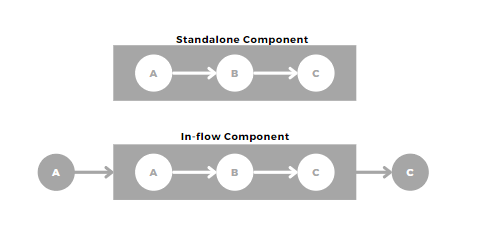

# Components

## What is a component?

Components are ways of packaging sets of regularly used tasks. This encourages modularity and re-use. 

This means a library of powerful workflows that are then simple dropping in  2-3 line YAML fragments.

Components can be structured as complete workflows or to slot into larger ones:

- **'In-flow'** using previous steps as inputs 
    - e.g. 'if', 'singer_multiplexer' 
- **'Standalone'** ones can be built as DAG full templates. The difference is this structure can use the Component Builder UI.   
    - e.g. 'db_to_snowflake'



 @TODO - screenshot of UI

The rest of this page will focus on how to build a Component. See [Using Components][1] for examples on how to use existing components.

## Component structure

As components are simply packaging a set of tasks they are simply a normal DAG but with some optional concepts:

- `name:`:    Descriptive name for the component.
- `args:`:    Any number of arguements that you need as inputs for teh parameter (e.g. table names, source hooks, target hooks etc.)
- `$COMPONENT_INPUT`:  (Optional) If you are making a in-flow component, this is assigns that input 
- `output`:    (Optional) If the component results in output to downstream tasks (rather than writing to a target hook) this allows you to assign them.   

This example component shows the usage of all the above variables. 

```yaml
name: if

args:
  condition: Callable[[T], bool]
  data: T

tasks:
  then:
    input: $COMPONENT_INPUT
    function: typhoon.flow_control.filter
    args:
      filter_func: !Py $ARG.condition
      data: !Py $ARG.data

  else:
    input: $COMPONENT_INPUT
    function: typhoon.flow_control.filter
    args:
      filter_func: !Py "lambda x: not $ARG.condition(x)"
      data: !Py $ARG.data

output:
  - then
  - else

```


[1]:../getting-started/using-components.md